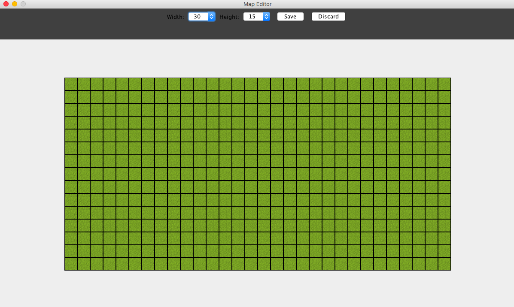
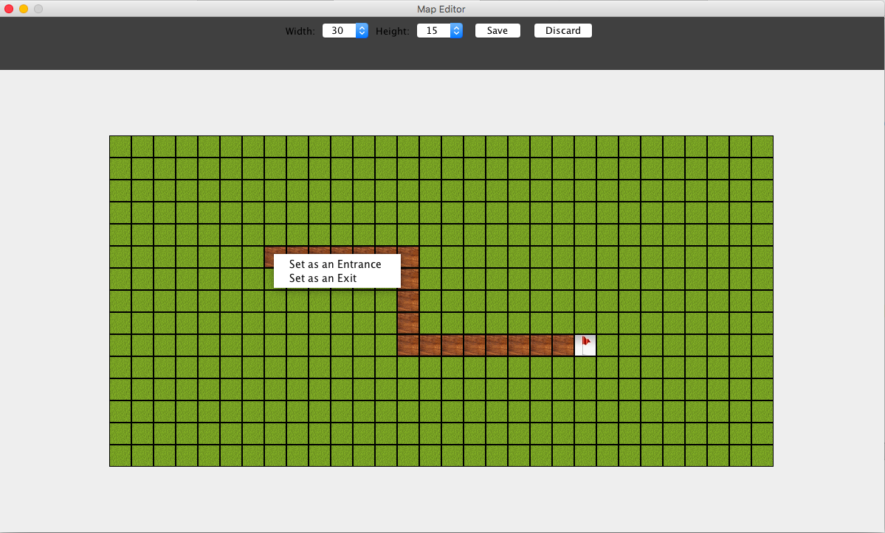
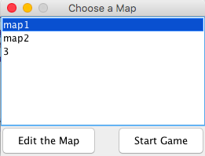
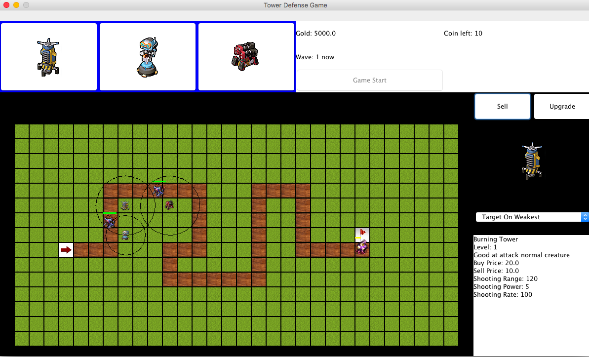
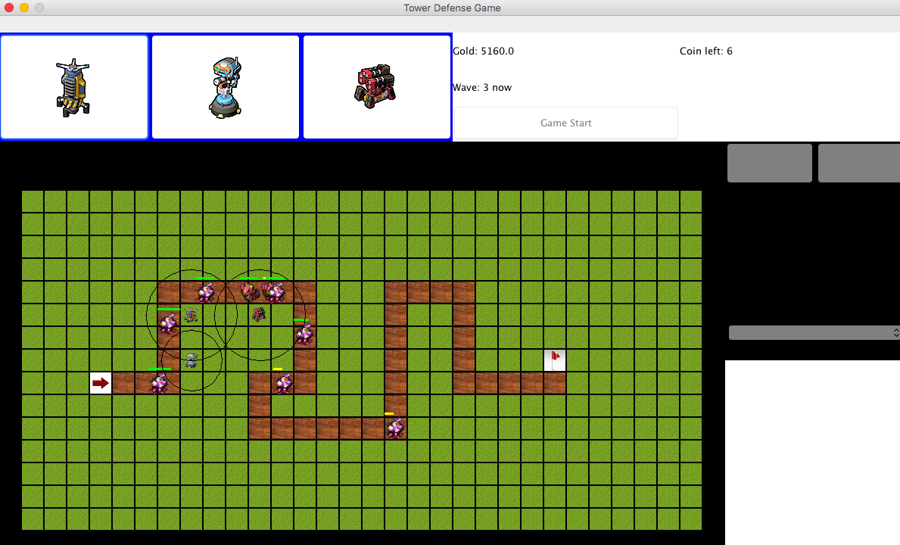

#Tower Defense Game

## About the Game

### Map Editor 
1. User can create a new map, edit a saved map
2. User can customize the map size, path, entrance and exit point of the map
3. MapValidator will validate map to prevent from saving illegal maps

4. User can start a new game by choosing a saved map

### Main Game
- Tower
    1. User can plant tower by click tower button
    2. Tower is in 3 different kinds, named Burning tower, Ice tower and Splash Tower   
        Which has different shooting behavior.
        -   Burning tower: critter will get continues damage
        -   Ice Tower: critter will get frozen for some period
        -   Splash Tower: it will case area of effect damage to critters
    3. When the tower is chosen, user can inspect the tower's specification, sell or upgrade this tower 
        and set different shooting strategy.
    4. User can choose 3 different kinds of shooting strategy for each tower
        - target based on weakest critter
        - target based on strongest critter
        - target based on closet to the end point critter

- Critter 
    1. There are 4 different kinds of critters. Some are fast but weak, some are slow but strong. 
    2. There are six different waves built in the game.
    3. when all the critters in the game has been shot all has stole a coin, a new wave start
    
- Money and Coin system
    1. Initial balance for the game is 5000 (to plant a new tower or upgrade a old tower)
    2. Coins(life) is 10. When the critters have stolen all the coins, game over.
    

 
### other details
1. This game is purely written in Java (Java Swing and AWT)
2. Map files are saved in JSON and by using GSON library
3. The image resources (Towers and critters) are from "Tower Defense" @ Com2uS USA)